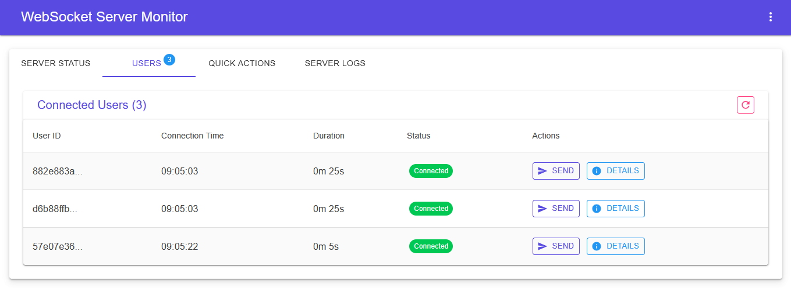
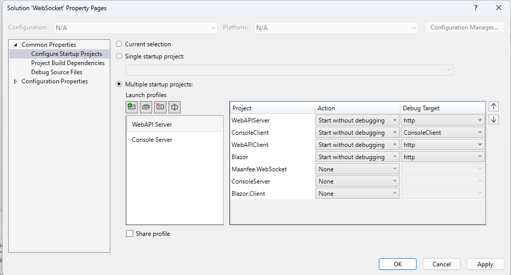
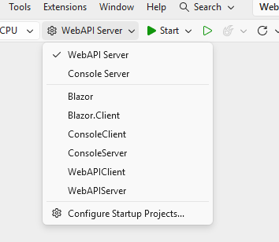

<div align="center">
  <picture>
    
  </picture>
  <h2 align="center">
        Maanfee WebSocket
  </h2>
  <p align="center">
        A comprehensive WebSocket library for .NET providing both client and server implementations with support for multiple application types.
  </p>
</div>

## 📦 Packages

### Maanfee.WebSocket
A high-performance WebSocket library for .NET including:
- `MaanfeeWebSocketServer` - Full-featured WebSocket server with user management
- `MaanfeeWebSocketClient` - WebSocket client with auto-reconnection capability
- `MaanfeeWebSocketOption` - Advanced configuration for connection settings
- `MaanfeeWebSocketUser` - Management of connected user information
- `WebSocketServerState` & `WebSocketClientState` - Comprehensive state management
- Event arguments and helper classes

### Maanfee.Examples
Example implementations demonstrating usage in different application types.

# 🛠️ API Reference

## WebSocketServer Methods

| Method | Description |
|--------|-------------|
| `Start()` | Start the server |
| `StopAsync()` | Gracefully stop the server |
| `HandleWebSocketConnectionAsync(WebSocket)` | Handle new WebSocket connections |
| `SendToAllAsync(string)` | Send message to all connected clients |
| `SendToClientAsync(string , string)` | Send message to specific client |
| `GetConnectedUsersCount()` | Get count of connected users |
| `GetConnectedUserIds()` | Get list of connected user IDs |
| `GetUserById(string)` | Get user by ID |
| `GetAllUsers()` | Get all users |
| `Dispose()` | Clean up resources |

| Events | Description |
|--------|-------------|
| `ClientConnected` | When new client connects |
| `ClientDisconnected` | When client disconnects |
| `ServerStopped` |  When server stops |
| `MessageReceived` | When message received from client |
| `StateChanged` | When server state changes |

## WebSocketClient Methods

| Method | Description |
|--------|-------------|
| `ConnectAsync()` | Connect to WebSocket server |
| `SendMessageAsync(string)` | Send message to server |
| `DisconnectAsync()` | Disconnect from server |
| `Dispose()` | Clean up resources |

| Events | Description |
|--------|-------------|
| `MessageReceived` | When message received from server |
| `ConnectionClosed` | When connection closes |
| `ErrorOccurred` | When error occurs |
| `Connected` | When connection established successfully |
| `StateChanged` | When client state changes |

# 🚀 Quick Start

### 📦 Installation

**Package Manager**
```xml
<PackageReference Include="Maanfee.WebSocket" Version="*" />
```
# Solution Configuration Guide

## Steps to Configure Multiple Startup Projects

1. **Open the Solution**
   - Right-click on the solution name in the Solution Explorer

2. **Access Solution Properties**
   - Go to `Properties`

3. **Configure Startup Projects**
   - Navigate to `Multiple startup projects`

## Available Project Profiles

### Web API Server Profile
- **Server**: Web API Server
- **Clients**: 
  - Blazor
  - Web API 
  - Console

### Console Server Profile  
- **Server**: Console Server
- **Clients**:
  - Blazor
  - Web API
  - Console

### Blazor Server Profile (Recommended)
- **Server**: Blazor Server
- **Clients**:
  - Blazor
  - Web API
  - Console

## Configuration Options
Each profile allows you to set different combinations of server and client applications for testing and development purposes.

<div style="display: flex; gap: 20px; flex-wrap: wrap; justify-content: center;">
    <div style="text-align: center;">
        
    </div> 
    <div style="text-align: center;"> 
         
    </div>
</div>
